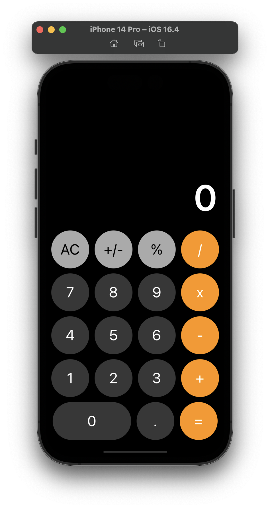

# Apple-Calculator-Rebuild
This project is a recreation of the popular Apple calculator made using SwiftUI as the programming language. The calculator has been designed to closely mimic the functionality and design of the original while also featuring a self-mimicked designed app icon.

<!---->
<!---->
## Features
**Basic Mathematical Operations:** The calculator supports four basic arithmetic operations: addition, subtraction, multiplication, and division.

**Percentage Calculation: `(In the near future)`** Using the percentage button, percentages can be calculated effortlessly.

**Sign Change: `(In the near future)`** It is possible to change the sign of a number by using the "+/-" button.

**Clear and Reset:** The "AC" button allows clearing the current input value.

## Installation
To use the calculator on your iOS device, first clone the repository:
```bash
git clone https://github.com/N3v1/Apple-Calculator-Rebuild.git
```
Then, open the Xcode project file Calculator.xcodeproj and run the app on your simulator or connected device.

## Customizing the App Icon
The app icon has been carefully designed to offer a unique and appealing user interface. If you wish to customize the app icon to suit your preferences, simply replace the `CalculatorProj.png` file in the project folder with your own icon, sized at 1024x1024 pixels.

## Technical Details
The calculator app has been developed using SwiftUI, a modern and declarative approach to building user interfaces on Apple platforms. SwiftUI provides a range of tools and features, enabling efficient development and ensuring a seamless user experience. 

Link to the SwiftUI Documentation **[here](https://developer.apple.com/xcode/swiftui/)**.

### Contributing
If you would like to contribute to this project, we welcome pull requests. Please ensure that your changes are well-documented and maintain clean, readable code. 

### License
This project is licensed under the MIT License - see the `LICENSE` file for more information.

### Known issues
None


### Upcoming features
- Percentage Calculation
- Sign Change
- Decimal numbers and sign


